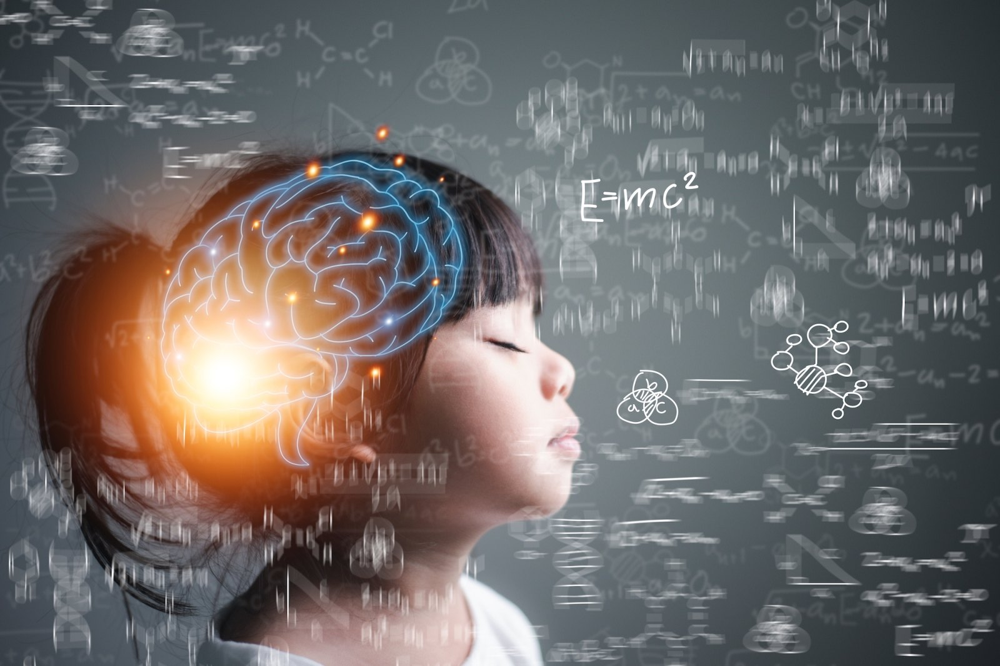

People often mention GIGO(Garbage In, Garbage Out) to stress the importance of high-quality data when training machine learning models. I believe this rule also applies to our human brain. Although a large part of the information feeded to our brain is not controled by ourselves, we should try our best to take in as much good knowledge and ideas as possible to achieve our goals. 

|    Date     |  Event Name   | Speaker      | Organizer  |  Platform  |   Duration         |  Key Topics    |    Label   | Comment |
| :---        | :----         | :----        | :----      | :----      |   :------          |:----              |:----       |:----    |
| 2024-04-17  | Make Time For What Matters | Chad Lawson (pianist and composer) | Thrive Global |  Zoom  | 45 mins | Music, mindfulness, and prioritizing our passions  |  Self-care | Peaceful and relaxing |
| 2024-04-16  | The Future of Entertainment | Anita Elberse (Harvard Business School professor) | Paramount Global - Spark | Vimeo | 1 hr 15 mins | Blockbuster, Superstars, Technology  | Media industry | Very informative, insightful, and inspiring |
