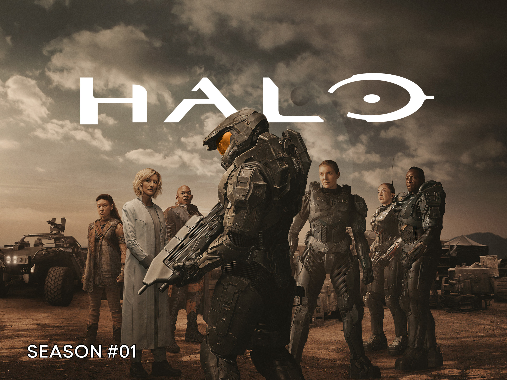

# Halo Notes

A friend suggested me to watch Halo. I found it difficult to understand. So I took some notes:

Planets:
- Madrigal: the one with the Koreans and the war, Rebels of the UNSC, 

- Reach: the one with Catherine and Spartans
City: Fleetcom - UNSC headquarters 

- Rubble: No rule, no law, absolute freedom
- High Charity: where aliens stay 
- Oban: Ueg tier 2 waste salvage colony
- Tantalus: wiped out by Covenant forces
- Eridanus Two: the planet John lived as a child

People:
- Kwan Ha: the only survivor of planate 

- Master Chief: Spartans 117, John, 

- Catherine Halsey: the doctor managing Spartans

- Admiral Parangosky: asked Catherine 
- Miranda Keyes: Catherine and the created Cortana’s daughter?
- Soren: on Rubble, John’s friend who escaped from Spartan training center on Reach
- Vinsher: the new top cat on Madrigal, traitor to the resistance, 
- Capital Keyes:
- Kessler: Soren’s son
- Reth: from the Cavenant 

Teams:
- Silver Team: Spartans
- Covenant: aliens attacking the Madrigal civilians, Kaidon warrior, 
- Madrigal civilians: rebel garrison of the UNSC
- 

System:
- Cortana system: clone, next stage in human evolution by Dr Halsey, 
- Epsilon Eridani system:
- Visper System: system on planet Oban

Objects:
- Relic
- Sacred ring
- 

Words:
- lethal: 致命的
- yarn: 纱线球
- bounty: 赏金
- morale: 士气
- pellet: 颗粒
- frigate: 护卫舰
- Condor:

How did the lady from the alien developed the superpower? She was just an ordinary girl on planet Oban. 
