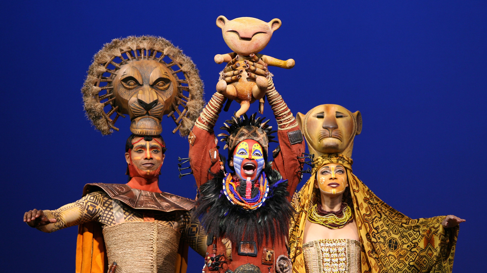

# My Journey of The Lion King

I finally got the chance to see The Lion King on Broadway! I've seen this story for at least four times. Each time with a very different experience and understanding.

最早开始接触《狮子王》大概是在五六岁的年纪，在爷爷奶奶家的黑白电视机上看的动画片。那时候对剧情一无所知，接收到的信息单纯只是动画画面。

后来念高中，英语老师为了奖励班级英语整体的好成绩，在某个晚自习带我们去学校的礼堂看电影动画版。那时候的我关注的点是自己能听懂几句台词，对剧情好像没有太多感觉。

本科的时候终于有了自己的电脑，在学校图书馆的电影网站上下载了动画版电影，看完之后就忘了。

2019年电影真狮版上映，买了票去电影院看了3D电影。看完之后对剧情还是没有太多感触，却对狮子这类动物产生了很大兴趣。那时候花了很多时间去查真实世界里狮子的生活状态和习性，了解到狮群的权力结构和运行方式。还跑去动物园看狮子，喜欢上看动物相关的纪录片《王朝》，也喜欢上听Circle of Life. 

2023的这个夏天，我选择来到纽约工作，体验生活。每天下班之后沿着Broadway走路回住处，看着附近各类音乐剧的广告招牌，我决定去体验百老汇剧场演出。虽然已经对《狮子王》的故事情节很熟悉了，可是我依然选择去看《狮子王》的音乐剧。尽管它的票价比很多其它音乐剧都高很多，我还是想趁着它还在演的时候去看，去欣赏，去感受，去体验一场视听盛宴。音乐剧演员们，现场交响乐团，以及舞台灯光和布景的完美配合，让观众们一次次欢呼鼓掌。这一次看完之后，我终于能够跟故事里角色的心境产生联结。少年辛巴单纯可爱，不谙世事；穆法沙善良睿智，对小辛巴的教育既温柔又有力；刀疤渴望权力，却没有能力在夺权之后治理好自己的天下；辛巴因为愧疚而选择的逃避和即时享乐并没有办法让它真正地快乐。即使跟最好朋友们在一起，它依然内心孤独，它清楚地知道自己的使命是什么，可是却没有勇气去面对困难与承担责任。直到他在河中的水面看到父亲穆法沙的面容并听到他的声音提醒他不要忘记自己是谁。(这一段唱的《He Lives in You》是我本次最爱的一首歌) 。受到鼓舞的辛巴终于鼓起勇气去承担自己的使命，与自己的叔叔刀疤决斗，夺回狮王的宝座，让曾经的狮群和草原恢复秩序与生机。

回顾自己对同一个故事的观后感的演化过程还蛮有意思的。我不知道下一次再接触这个故事会在什么时间什么地点，但是我很期待下一次的体验和感悟。