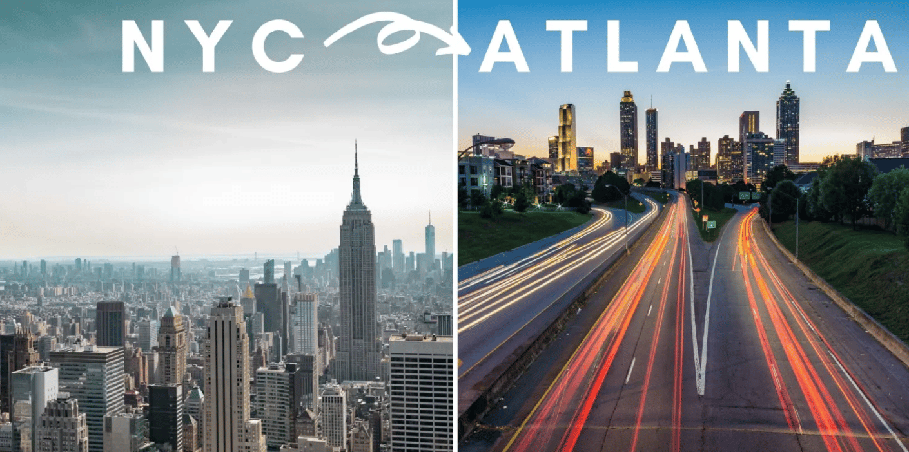

# Back to ATL from NYC

从纽约回亚特兰大五天了，一直在搬家和收拾屋子，现在终于有空来写点东西记录一下这段时光。

上周二以中午跟同事在时代广场的意大利餐厅聚餐和晚上跟好友在中国城的泰国餐厅聚餐的方式跟纽约告别。最后一次走到时代广场看广告和感受人群，内心充满不舍，可是也对回亚特兰大的新生活充满期待！

周二晚上回到宾馆收拾行李到半夜，周三早上起来继续收拾之后于10点半退房出发前往机场。从宾馆到机场18英里的路程，打车需要九十来美金，坐公共交通只需要十来美金。可是仔细想想，两种交通方式的主要差别就是搬运行李那几分钟的差别，其实大部分时间都是在车上坐着。于是为了省钱的我提着两个大行李箱，外加背着一个双肩背包，就出发前往地铁站了。纽约街头的地铁站没有电梯，所以提行李箱上下地铁真的很费劲。结果我第一次还进错地铁站入口，白费一番功夫抗行李上下台阶。后面找到正确的地铁站入口之后就已经没有力气了，幸好遇到一个路过的小姐姐主动帮我搬了一个行李箱我才顺利坐上第一个地铁。在布鲁克林的地铁站转站的时候，本来有自动扶梯的，结果我要坐的那个长长的扶梯out of service了，于是我望着窗旁边长长的楼梯台阶彷徨着，不知该如何是好。路过一个印度大叔主动过来问我是不是迷路了，我说没有迷路，只是电梯不开，我行李没有办法运下去。于是他热心拿过我那个大行李箱，很耐心地告诉我不用担心，然后一个台阶一个台阶地帮我把箱子搬下去。他跟我说他很喜欢中国人，因为中国人和他们一样，工作都很努力。他很多年前全家一起搬到了纽约，现在一大家子九口人一起住在机场附近的房子里。他吐槽这里的一些人拿着政府的补贴不干活，天天只知道吃和享受，身体坏掉之后去医院又是政府给钱治病。第二次转站的时候是在一个比较高级的车站，有电梯，所以方便很多。比较有意思的事情是，这边需要另外买票坐车，票价大概是9美金，自动检票口。然后就有很多人在检票口门口招揽生意，乘客可以给他们现金，他们把检票口门打开让乘客通过。不过大部分人都是选择排队在机器上买票进站。

上飞机之后坐在我旁边的是一个来自四川的中国女人，大概五十多岁，非常热心，跟我聊了一堆关于移民和约会的话题。

回到亚特兰大之后在好友M家住了一晚上(感谢她的收留)之后第二天就前往Uhual提了预先租好的货车准备搬家。办事人员是个很热情的小伙子，围绕着我的名字跟我闲聊了好一会儿。提车之后我也没有仔细检查车，就直接开走了。这是我第二次开货车了，比第一次娴熟很多。 自己一个人慢慢把Storage里的家当搬到货车上。因为有小推车，再加上Queen size的床已经卖二手卖掉了，搬东西的过程比想象中的快很多。 搬完之后发现车有一个后视镜碎了一些，以为是我停在storage的时候被别人不小心撞到了。有点后悔自己没有停在比较靠后一点的地方，可是后悔也没有用。还好买了保险，最坏的结果也就是赔两三百刀，就不想了。然后又发现车轮胎里卡了烂布和烂毛巾，也不知道是哪里弄进去了。怕影响车的行驶，我用剪刀和小刀躺在车底下的地上扯了好几次，每次扯好久，最后才彻底扯干净。实在扯不动的时候绝望之下跟上帝祷告，结果突然一下子就扯掉了，也是神奇的经历。还车的时候碰到的办事员还是上次遇到的小伙子，我主动告诉他我不小心把后视镜弄碎了。他问我是怎么弄碎的，我说我没有看到，我就把车停在某个地方，可能别的车路过的时候不小心碰到的。他再次询问我有没有亲眼看到后视镜被弄碎，我说没有看到。结果他告诉我说，不是我的问题，是之前租借的人的责任，还笑着告诉我说租车之前要先仔细检查车是否有缺陷。他最后没有收我任何罚金，还告诉我我很诚实。我问他如果真的是我弄碎的，要赔多少钱。他说了一个数字我已经不记得了，大概是超过一千，但是保险cover之后，我大概要付三百刀。换一个后视镜居然这么贵，我很惊讶。但是仔细想想，这个花费不只是后视镜的价值本身，也包括换后视镜和处理这个事件的人工费，再加上还有车因为换后视镜而不能被租出去而损失的收益。这样想，也就合理了。

租车这件事情让我感概颇多，明白拥有一个平和的心态是多么重要。后视镜虽然碎了，我就简单接受这个事情，没有让它影响到我的情绪，所以没有影响我搬家的进程。最后没有被罚钱，我很开心也很感恩，同时也感概还好之前都平静处理。如果我之前因此而感到非常焦虑或者沮丧自责的话，那其实都是没有必要的。越长大越觉得平和的心态才是最宝贵的财富！
