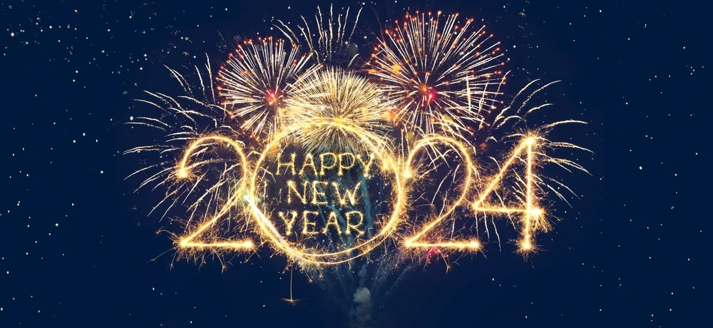

# Happy New Year

### Happy New Year to Mandy!!!

---

&nbsp;

As I sit here, on the eve of Lunar New Year 2024, a significant day known as Nian (年) in my hometown, I am compelled to reflect on the significance this day held for me as a child.

&nbsp;

In my youth, I eagerly anticipated the arrival of Nian. It was a day filled with excitement and tradition. However, I distinctly remember adults expressing weariness towards the festivities, a sentiment I couldn't comprehend at the time. Fast forward to the present, and I find myself in a different frame of mind.

&nbsp;

Interestingly, my perspective on Nian has shifted. While the anticipation still lingers, it no longer consumes my thoughts as it once did. When a friend recently inquired about my plans for celebrating Nian, they were taken aback by my response. Instead of traditional festivities, I expressed my desire to work on building my personal website.

&nbsp;

Their surprise was understandable. After all, Lunar New Year is typically a time reserved for joyous gatherings with loved ones. Despite my unconventional choice, I did accept two invitations to celebrate Nian. I recognized the value in cherishing these moments with friends and family, understanding that amidst the hustle and bustle of everyday life, such occasions are precious.

&nbsp;

As I embark on this new Lunar Year, I am reminded of the importance of balance. While pursuing personal goals and ambitions is essential, it is equally vital to embrace the traditions and connections that enrich our lives. So, as I raise a toast to the year ahead, I do so with gratitude for both the past and the future, recognizing the beauty in blending old traditions with new beginnings.
